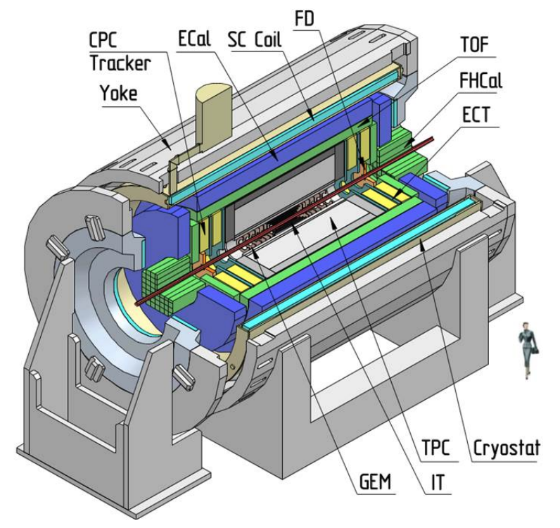
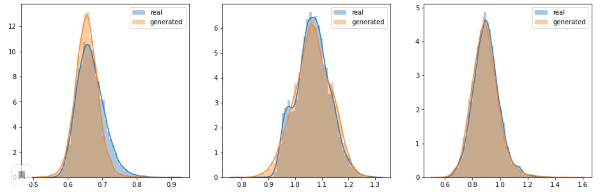
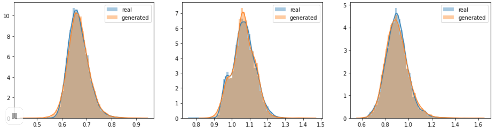
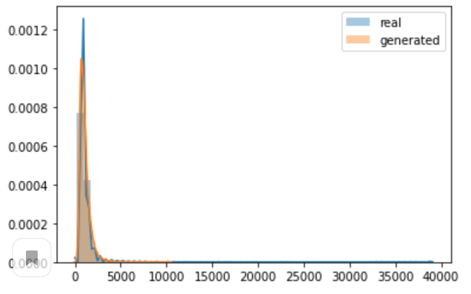
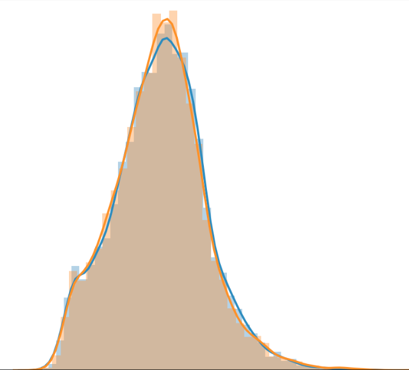
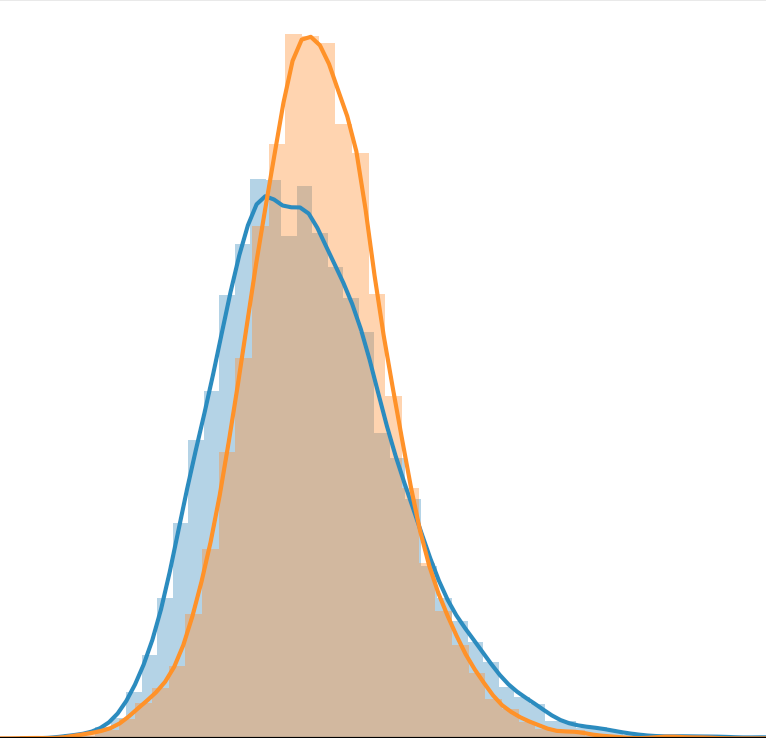

# Построение генеративной модели для симуляции отклика трекера детектора MPD на ускорителе НИКА

1. [Физический background](#physical-background)
1. [Струкрура репозитория](#струкрура-репозитория)
1. [Обучние](#про-обучение)
1. [Технические ремарки](#технические-ремарки)

## Physical Background

В камере детектора движется частица, сталкиваясь с молекулами газа. 
Столкновения приводят к ионизации молекул газа и появлению свободных электронов (первичной ионизации),
который сталкиваясь может производить еще электроны (вторичной ионизации). 
Электрон первичной ионизации и вторичной ионизации образуют ионизационный кластер, который дрейфует под воздействием электрического поля
к левой стенке камеры, подходя к анодным проволочкам.Они индуцируют заряды на катодных пэдах. Информация об амплитуде этих зарядов собирается с пэдов.

Изображние камеры детектора:

## Струкрура репозитория
1. [Архитекруты лучших моделей](https://github.com/prutianova-nastia/PhysGAN/tree/master/train/models)
1. [Рассчет метрик качества для модели без параметра](https://github.com/prutianova-nastia/PhysGAN/blob/master/notebooks/Unparameterized_model_results.ipynb)
   [Рассчет метрик качества для модели принимающей параметр](https://github.com/prutianova-nastia/PhysGAN/blob/master/notebooks/Parametrized_model_results.ipynb)
1. [Oбученные модели в формате .h5](https://github.com/prutianova-nastia/PhysGAN/tree/master/saved_models)

## Про обучение
#### Про количество итераций 
Модели обучаются порядка 3000-5000 итераций, в папке saved_models есть модель generator_1000
обучавшаяся 1000 итераций и модель best_unparameterized с такой же архитектурой.

После 1000 итераций графики распределений ковариации выглядели так: 

А после 5000 итераций так:

#### Про логарифмирование амплитуды
В исходных данных амплитуда распределена так что следнее значение амплитуды равно примерно 100 а максмимальное 40000
то есть достаточно не равномерно, распределение выглядит так:

Лучше "выучить" это распределение модели может помочь логарфирование амплитуды, 
однако это приводит к тому что после обратного взятия экспоненты распределения других метрик
могут ухудшаться так например:
Такое распределение(covariance pad):

Может превратиться в такое:

После обратного взятия экспоненты&

# Технические ремарки
Sourse of inspiration for coding:  https://github.com/keras-team/keras-contrib/blob/master/examples/improved_wgan.py
Основной код для обучения моделей находится в папке train

## To run locally
* source ./venv/bin/activate - асtivation command ([full tutorial on tf](https://www.tensorflow.org/install/pip?hl=ru))
* python main.py (to start training)
* python watch_results.py (to plot results)

## To run on GPU
Connect GPU server:
* ssh -p 2222 aprutyanova@92.242.58.230
* ssh aprutyanova@172.21.210.34

Docker commands:

* delete docker image: docker rmi image-id
* run bash image: docker run -it image-id bash
* build docker: docker build -t <user>/<repo-name>[:<tag>] directory-path
* to copy file from docker image:
* docker run --name temp-container-name image-name /bin/true
* docker cp temp-container-name:/path/to/file /local/path/to/file
* docker rm temp-container-name
* to authorize in docker: docker login docker.io 

[To run on gpu](https://github.com/prutianova-nastia/PhysGAN/blob/master/GPU/docker_run.sh)

Don't forget to set parameter GPU in [config-file](https://github.com/prutianova-nastia/PhysGAN/tree/master/train/config) True
