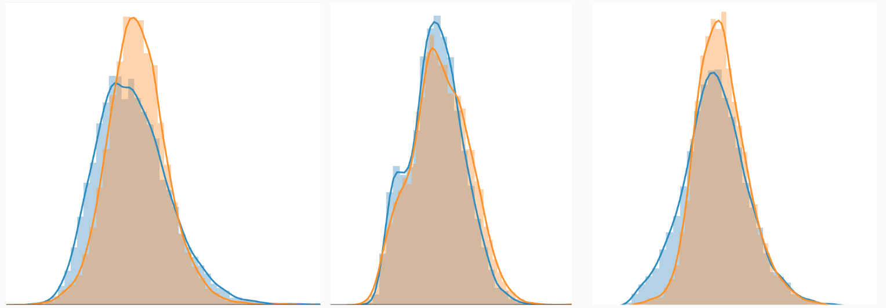

# Построение генеративной модели для симуляции отклика трекера детектора MPD на ускорителе НИКА

1. [Физический background](#physical-background)
1. [Струкрура репозитория](#cтрукрура-репозитория)
1. [Логарифмирование амплитуды](#curator)
1. [Технические ремарки](#технические-ремарки)

## Physical Background

В камере детектора движется частица, сталкиваясь с молекулами газа. 
Столкновения приводят к ионизации молекул газа и появлению свободных электронов (первичной ионизации),
который сталкиваясь может производить еще электроны (вторичной ионизации). 
Электрон первичной ионизации и вторичной ионизации образуют ионизационный кластер, который дрейфует под воздействием электрического поля
к левой стенке камеры, подходя к анодным проволочкам.Они индуцируют заряды на катодных пэдах. Информация об амплитуде этих зарядов собирается с пэдов.

Изображние камеры детектора:

## Струкрура репозитория
1. [Архитекруты лучших моделей](https://github.com/prutianova-nastia/PhysGAN/tree/master/train/models)
1. [Рассчет метрик качества для модели без параметра](https://github.com/prutianova-nastia/PhysGAN/blob/master/notebooks/Unparameterized_model_results.ipynb)
   [Рассчет метрик качества для модели принимающей параметр](https://github.com/prutianova-nastia/PhysGAN/blob/master/notebooks/Parametrized_model_results.ipynb)
1. [Oбученные модели в формате .h5](https://github.com/prutianova-nastia/PhysGAN/tree/master/saved_models)

## Про обучение
Модели обучаются порядка 3000-5000 итераций, в папке saved_models есть модель generator_500
обучавшаяся 500 итераций и модель best_unparameterized с такой же архитектурой
после 500 итераций графики распределений ковариации выглядели так: 

а после 4000 итераций так:

# GANS
Sourse of inspiration:  https://github.com/keras-team/keras-contrib/blob/master/examples/improved_wgan.py
###To run:
* source ./venv/bin/activate - асtivation command
* python run.py
* python load_model.py (to plot resultes)
